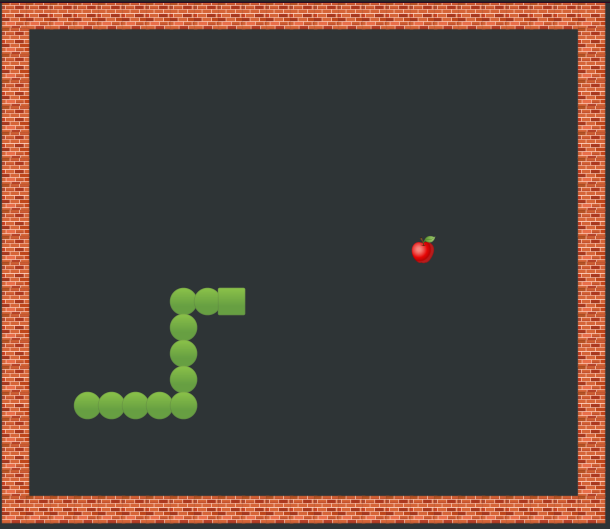
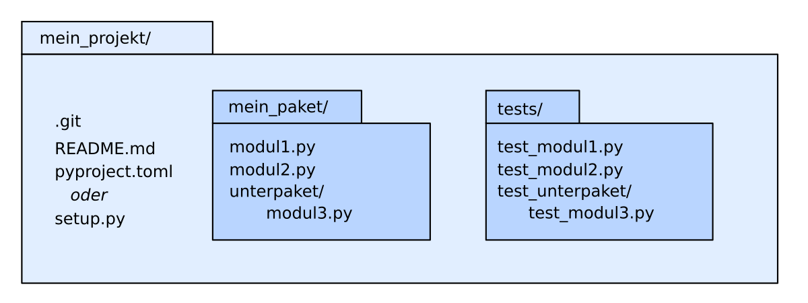

# Python Programme strukturieren und warten

Dies sind die Materialien zu meinem Vortrag bei den IT-Tagen 2022.

Der Code findet sich auf [github.com/krother/snake](https://github.com/krother/snake)

Im [Artikel in der Informatik Aktuell](https://www.informatik-aktuell.de/entwicklung/programmiersprachen/python-anwendungen-strukturieren-testen-und-warten.html) finden sich Links und eine ausführlichere Beschreibung der verwendeten Werkzeuge.

----

## Beispiel: Snake

Als Beispiel untersuchen wir ein kleines aber repräsentatives Softwareprojekt:

----

## Vorbereitungen

Um die Beispiele selbst auszuprobieren, führe folgende Schritte aus:

* installiere Python (Version 3.8 oder höher), für Einsteiger empfehle ich die [Distribution Anaconda](https://www.anaconda.com/)
* lade den Code aus diesem Repository herunter
* wechsle in das Hauptverzeichnis des Repository (`snake/`)
* installiere die Bibliotheken. Gib dazu in einem neuen Terminal-Fenster ein:

    pip install -r requirements.txt
    pip install -r dev_requirements.txt

Unter Windows ist zusätzlich notwendig:

    pip install windows-curses

Nun installiere das Paket im Entwicklungsmodus:

    pip install --editable .

Wenn alles funktioniert hat, sollte das Spiel starten:

    python snake

----

## 1. Objektorientierte Programmierung (OOP in Python)

* Klassen in Python
* Doppel-Unterstrich Methoden
* Properties
* Pydantic

### 1.1 Klassen in Python

In der Datei [snake/game.py](snake/game.py) lassen sich grundlegende Elemente einer Python-Klasse beobachten:

* Klassendefinition
* der Konstruktor `__init__()`
* Attribute
* Methoden
* der obligatorische Parameter `self`

### 1.2 Doppel-Unterstrich-Methoden

Methoden, die mit zwei Unterstrichen beginnen und enden, haben eine Sonderfunktion.
Meist überladen sie einen Operator o.ä. Einige Beispiele:

| Methode | Beschreibung |
|---------|--------------|
| `__repr__` | liefert String, wird von `print(x)` und `str(x)` verwendet |
| `__len__` | wird von `len()` verwendet |
| `__gt__` | macht Objekte der Klasse sortierbar |
| `__hash__` | liefert Hash, falls die Klasse als Schlüssel im Dictionary verwendet werden soll. |
| `__add__` | zwei Objekte der Klasse werden addierbar. |

Außer `__repr__()` sind viele dieser Methoden schwer zu lesen und erhöhen die Transparenz des Codes nicht sehr.
Bitte sparsam einsetzen.

### 1.3 Properties

**Properties** in Python ersetzen getter/setter-Methoden.
Eine mit `@property` deklarierte Methode verhält sich wie ein Attribut.

Auch hierfür findet sich ein Beispiel in [snake/game.py](snake/game.py).

### 1.4 Pydantic

**Pydantic** erlaubt es, die Attribute mit Typ zu definieren und führt **Typüberprüfungen zur Laufzeit** durch.
Der Konstruktor `__init__()` ist dadurch oft nicht nötig.

Ein Beispiel ist in [snake/player.py](snake/player.py).

Aufgabe: Wandle PlayingField in eine Subklasse von BaseModel um, so daß der Konstruktor __init__() nicht nötig wird.

### 1.5 Weitere Themen

Auf [www.academis.eu/advanced_python](https://www.academis.eu/advanced_python) befinden sich weitere Beispiele zu:

| Begriff | Beschreibung |
|---------|--------------|
| Vererbung | Superklasse, Funktion `super()` |
| Dekorator-Klassen | Abkürzung für das Decorator-Pattern, oft nicht nötig |
| Abstrakte Basisklasse | sinnvoll für streng strukturierte Klassen |
| Mehrfachvererbung | möglich anstelle von Interfaces, in der Praxis riskant |
| Metaklassen | Finger weg! |

### Aufgabe

Füge eine Property `PlayingField.foodx` und `PlayingField.foody` hinzu,
um `game.py:get_symbols()` lesbarer zu gestalten.

----

## 2. Automatische Tests

* Unit Tests
* Testen von Ausnahmefehlern
* Testparametrisierung
* Mocking

### 2.1 Unit Tests

Das Framework `pytest` ist dem Modul `unittest` aus der Standardbibliothek deutlich überlegen.
Dateien mit Tests, Testfunktionen und Testklassen werden über `test_` im Namen automatisch erkannt.
Der Ausdruck nach einem `assert`-Befehl entscheidet ob der Test erfolgreich ist.

Beispiele für Unit Tests befinden sich in [tests/test_game.py](tests/test_game.py)

Führe die Tests aus mit:

    pytest -s --cov snake

### 2.2 Testen von Ausnahmefehlern

Erwartetes Fehlerverhalten läßt sich mit einem **Context Manager** abfangen, z.B.:

    with pytest.raises(ValueError):
        int("abc")
    
Der Test ist nur erfolgreich, wenn der Code im `with`-Block tatsächlich die angegebene Ausnahme hervorruft.

### 2.3 Testparametrisierung

Aus Listen von Testdaten lassen sich viele Tests generieren, ohne Code zu verdoppeln.
Dazu wir der Testfunktion ein Dekorator vorangestellt:

    @pytest.mark.parametrize('param,expected', TEST_DATA_EXAMPLES)
    def test_foo(param, expected):
        assert foo(param) == expected

### 2.4 Mocking

Mit `unittest.mock.patch` läßt sich ein Teil des Programms zur Laufzeit temporär durch ein Platzhalter-Objekt (Mock) ersetzen.
Mocking ist prima um Unit Tests von Datenbankverbindungen usw. unabhängig zu machen.

### 2.5 Weitere Themen

Auf [www.academis.eu/python_testing](https://www.academis.eu/python_testing) findet Ihr ein pytest-Tutorial.

### Aufgabe: 

Schreibe einen Test, bei dem die Schlange eine Frucht frisst und ein Element länger wird.

----

## 3. Wartung

### 3.1 Paketstruktur

Diskutiere die Begriffe **Paket**, **Modul** und **sys.path**.

### 3.2 requirements.txt

Definiert Paketabhängigkeiten.
Installation wie oben angegeben mit:

    pip install -r requirements.txt
    pip install -r dev_requirements.txt

### 3.3 setup.py

Enthält Metadaten, die eine Installation des Pakets mit `pip` erlauben:

    pip install --editable .

Ausliefern des Pakets in den Ordner `dist/` ist möglich mit:

    python setup.py sdist

Es ist legitim, sich ein `setup.py` von irgendwo zu kopieren, der Code ist nicht besonders anspruchsvoll.

In naher Zukunft wird `setup.py` durch `pyproject.toml` ersetzt, welches von Tools wie **poetry** unterstützt wird.
Dies ist aber noch nicht vollständig stabil.

### 3.4 isort

Sortiert die Import-Anweisungen alphabetisch:

    isort snake/__main__.py

### 3.5 black

Räumt den Code nach dem PEP8-Standard auf:

    black snake/__main__.py

### 3.6 Details

Einige der obigen Werkzeuge sind auf [www.academis.eu/software_engineering](https://www.academis.eu/software_engineering) ausführlicher beschrieben.

----

## 4. Vergleich Python vs. andere Sprachen

Python hat viele Gesichter:

| Form | Zeilen | Kommentar |
|------|--------|-----------|
| Jupyter Notebook | < 100 | Datenanalysen und Prototypen ähnlich zu R und Matlab |
| prozedurale Programme | < 1000 | Datenpipelines |
| funktionale Programme | < 1000 | zustandslose Datenpipelines, mit Ideen wie map/reduce |
| objektorientierte Programme | < 10000 | Klassen mit Wechselbeziehungen, ähnlich Java/C++ |
| Softwarepakete mit vielen Unterpaketen | < 500000 | Über viele Ordner verteilt, fehlende Kapselung problematisch |
